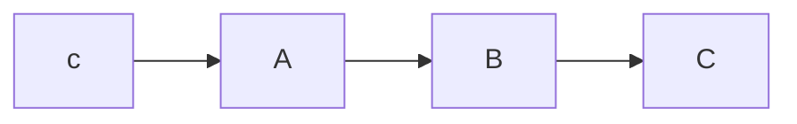

```{javascript cmd:"node", id:"j49bsei7"}
// var date = Date.now()
console.log(new Date())
```

???
# 这个标题拥有 1 个 id {#id1}
# 这个标题有 2 个 classes {.class1 .class2}

*这会是 斜体 的文字*
_这会是 斜体 的文字_

**这会是 粗体 的文字**
__这会是 粗体 的文字__

_你也 **组合** 这些符号_

~~这个文字将会被横线删除~~

* Item 1
* Item 2
    * Item 2a
    * Item 2b

1. Item 1
1. Item 2
1. Item 3
   1. Item 3a
   1. Item 3b

 ---

 连字符

 ***

 星号

 ___

 下划线


 我觉得你应该在这里使用
 `<addr>` 才对。


 ```ruby
 if (watermark_type_str.empty())
 {
     watermark_type = Utils::getDefaultShareWatermarkType(tree->getWatermarkType(node_id), share_manager->getDefaultWatermarkTypeByShareType(share_type),
         tree->getNodeDocType(node_id), tree->isNodeDirectory(node_id));
 }
 ```

 ```javascript {.class1 .class2}
function add(x, y) {
  return x + y
}
```

```javascript {.lineNo}
function add(x, y) {
  return x + y
}
```

[^1]: Hi! This is a footnote
